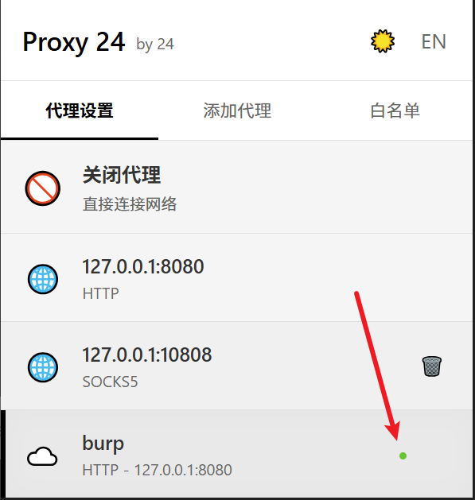
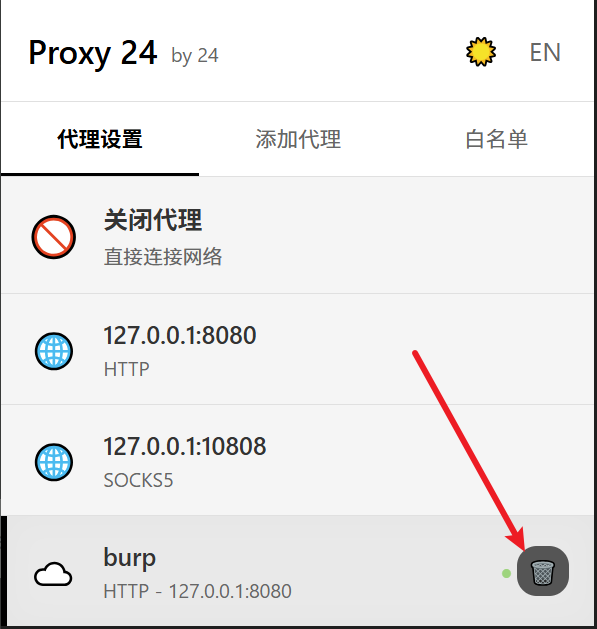
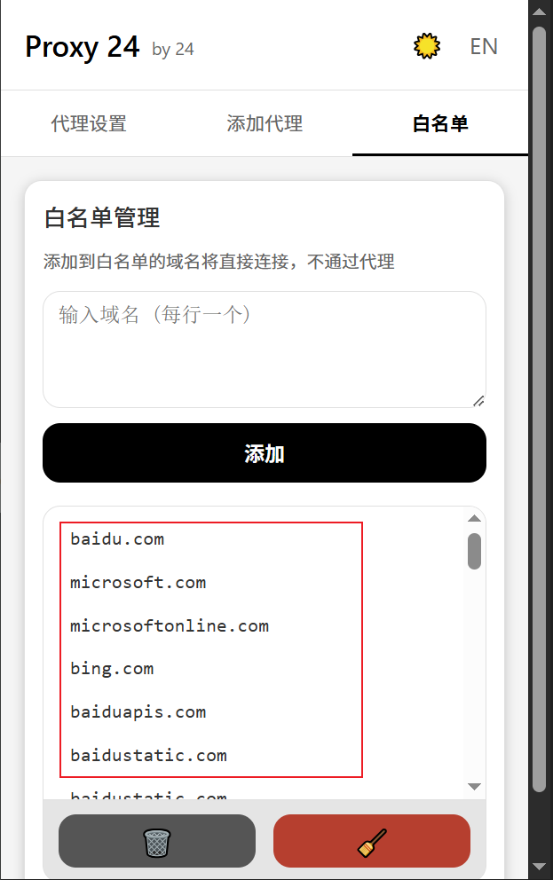
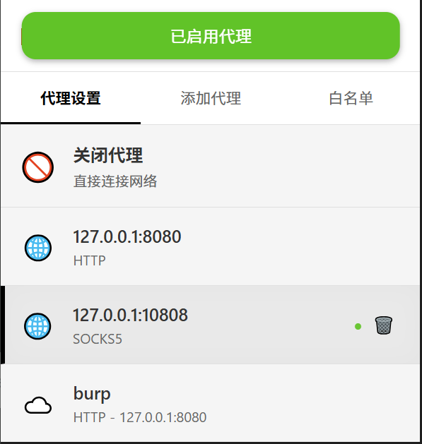
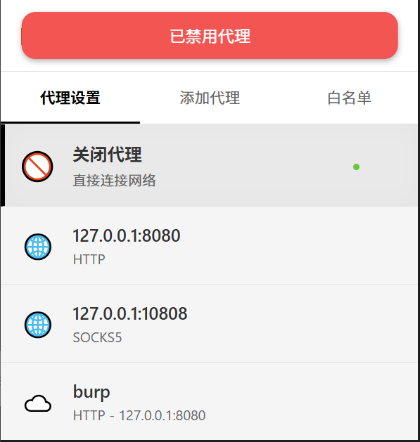
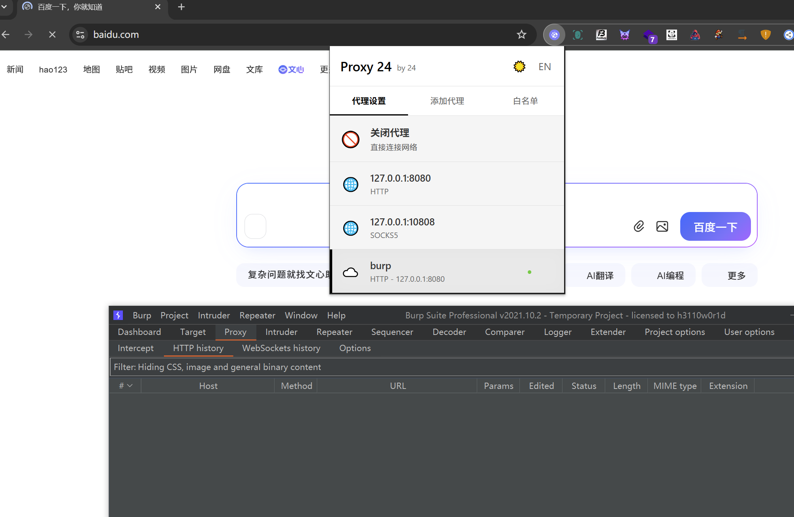
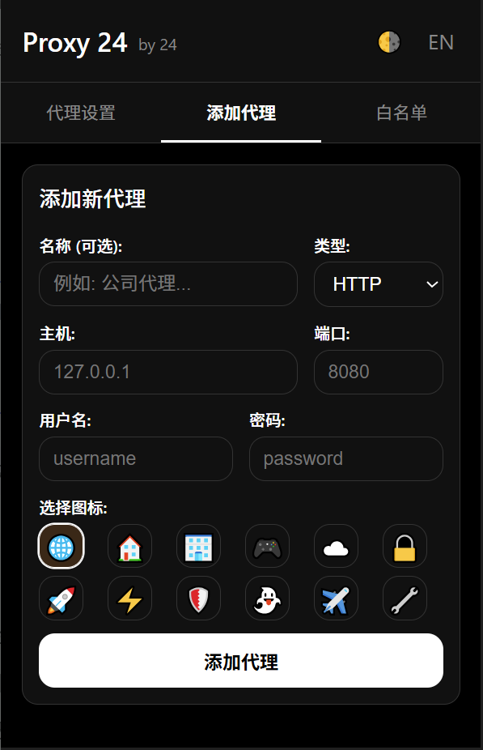
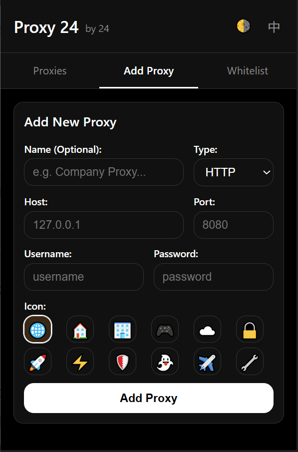

# Proxy 24

一个简单的代理插件，白名单很干净，没有任何后门，干净又卫生

## 支持的浏览器

- Google Chrome
- Microsoft Edge
- Firefox
- Quark

## 支持的协议

- HTTP

- HTTPS

- SOCKS4

- SOCKS5

## 应用商店

Firefox-https://addons.mozilla.org/zh-CN/firefox/addon/proxy24/

Microsoft Edge-https://microsoftedge.microsoft.com/addons/detail/proxy24/ehlobeopbpgminfelkofbcmkdigibnej

Quark-已申请(待通过)

## 添加代理

启用代理时会有呼吸灯提示已启用

## 删除代理

## 白名单

白名单默认是根据config.yaml字典配置的，也可以自行添加

## 启用代理关闭代理

## 测试白名单

## 切换模式

切换黑色主题

切换英文

外国师傅想用也是比较友好

## 更新日志
2026.02.03更新3.6修复系统代理覆盖bug，优化UI，新增启用代理显示粉色ON

2026.01.30更新3.2版本 新增修改代理功能

2026.01.29更新3.1版本 优化界面，修复bug，界面更加简洁，加入锐角，新增中英文切换、黑色主题白色主题切换

2026.01.29更新3.0版本 优化界面，界面重构，更加简洁，更加安全

2025.05.22 更新2.1版本 新增config.yaml文件用来管理白名单

## 致谢

♥感谢0verf1ow5师傅提出优化建议

♥感谢3had0w师傅提出优化建议

♥感谢en0t5f师傅提出优化建议

♥感谢罗辑师傅提出Firefox商城安装的插件会有被系统代理覆盖的bug

