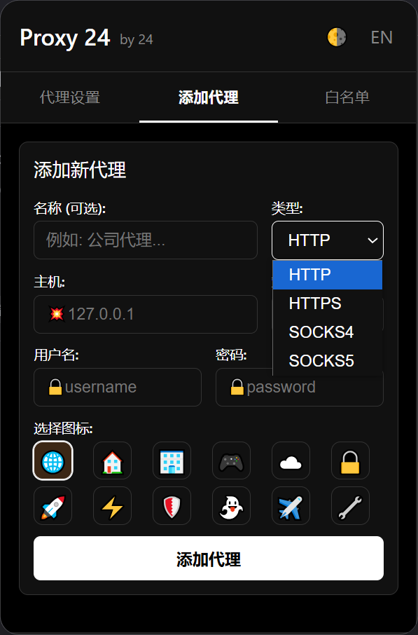
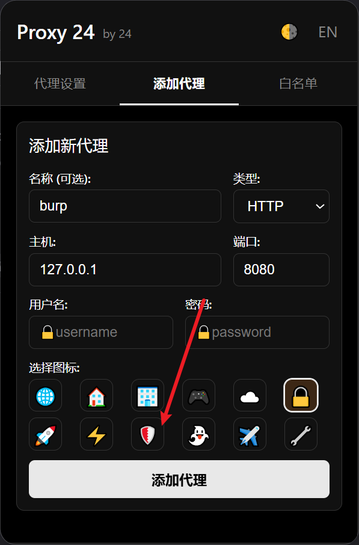
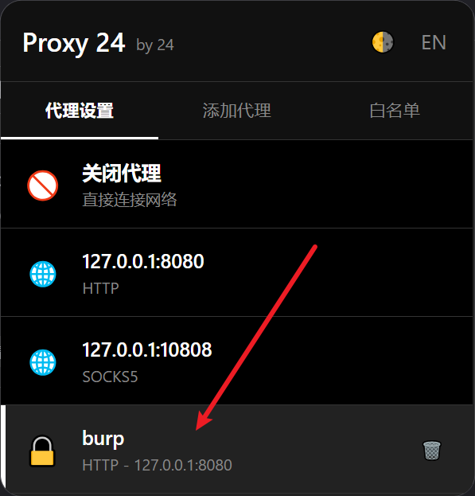
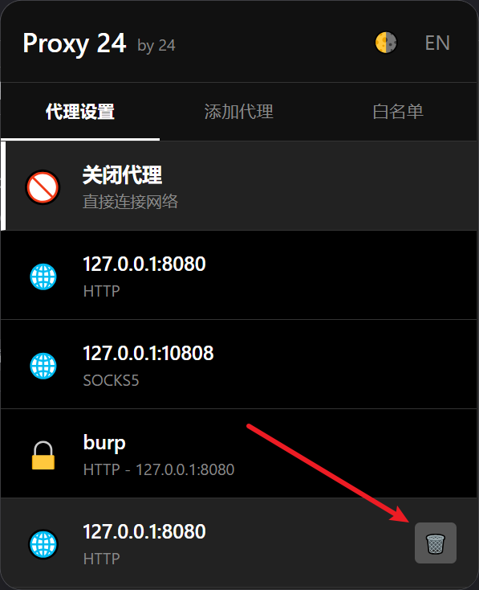
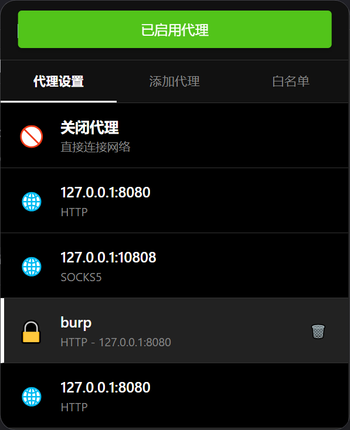
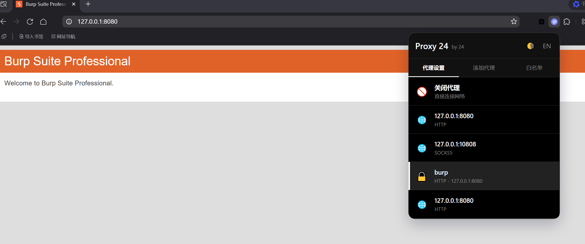
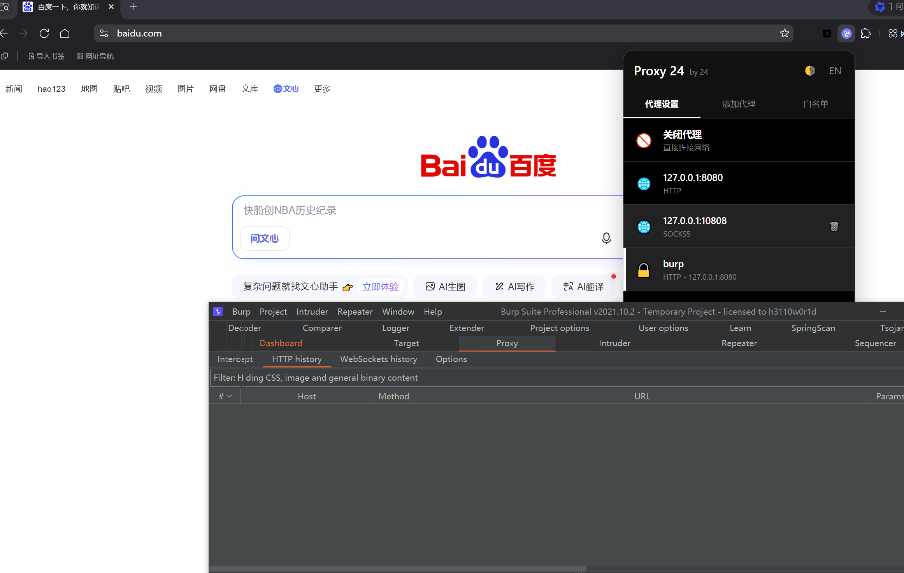

# Proxy 24

一个简单的代理插件，白名单很干净，没有任何后门，干净又卫生

## 支持的浏览器

- Google Chrome
- Microsoft Edge
- Firefox
- Quark

## 支持的协议

http

https

Socks4

Socks5

## 添加代理

添加代理时增加用户名密码

## 删除代理

## 白名单

不再赘述

## 启用代理关闭代理

测试白名单

## 更新日志

2026.01.29更新3.0版本 优化界面，界面重构，更加简洁，更加安全

2025.05.22 更新2.1版本 新增config.yaml文件用来管理白名单

